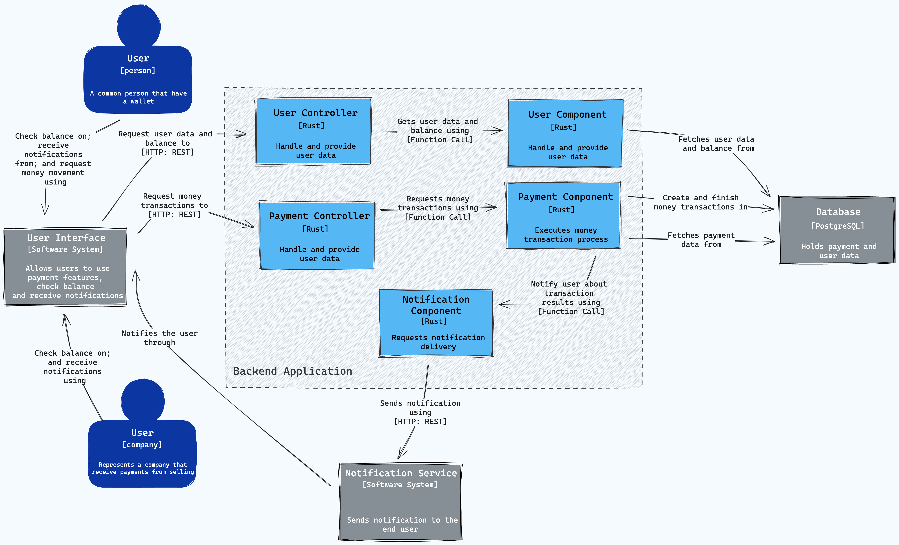
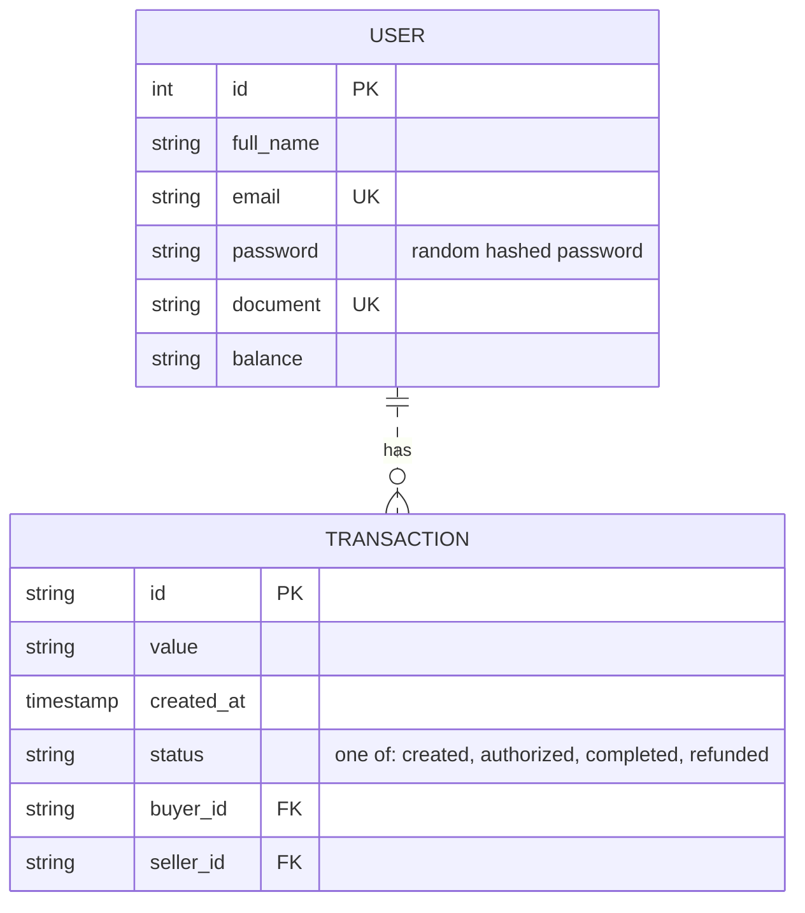

# PicPay Backend Challenge

<div align="center">

[](https://www.rust-lang.org/)
[](https://www.docker.com/)

</div>

This is a project developed for the PicPay Backend Challenge.

## Requirements
- [Docker](https://docs.docker.com/install/)
- [Docker Compose](https://docs.docker.com/compose/install/)
- [Rust](https://www.rust-lang.org/tools/install) (optional)

## The Business
The challenge is to implement a simplified version of a payment API, where it is possible to:
- Create a new transaction
- Consult a transaction
- List all transactions

In this app there are 2 types of users:
- Buyers: who will make and receive payments
- Sellers: who will receive payments

### Specific Requirements

- During the creation of a transaction, the buyer must be able to pay a value to the seller only if the buyer has sufficient balance.
- During the creation of a transaction, your application must call the endpoint of the PicPay Authorization Simulator to authorize the transaction.
- In case of any inconsistencies in the transaction, your application should return the monetary value to the buyer.
- After finish the transaction, the buyer and the seller must receive a notification through the PicPay Notification Simulator.
- 

**PicPay Authorization Simulator**: `https://run.mocky.io/v3/5794d450-d2e2-4412-8131-73d0293ac1cc`
**PicPay Notification Simulator**: `https://run.mocky.io/v3/54dc2cf1-3add-45b5-b5a9-6bf7e7f1f4a6`

## The Solution
The solution was developed using Rust, with the Rocket framework, and PostgreSQL as database.
The application is containerized using Docker and Docker Compose.


### Architecture Diagram (C4 model)


### Database Diagram


> Other than ID and balance, all fields are fake and not used in the application.

### API Documentation

#### Create a new transaction
##### Request:
```http
POST /transactions
{
    "value": "100.00",
    "payer": "1",
    "payee": "2"
}
```

##### Responses

**201:**
As the transaction happens syncronously, the response will be 201(Created).
If the process were asyncronous, the response would be 202(Accepted).
```json
{
  "id": "1",
  "value": "100.00",
  "created_at": "2021-05-02T20:00:00Z",
  "status": "created",
  "buyer_id": "1",
  "seller_id": "2"
}
```

**400:**
Causes:
- Invalid payload
- Insufficient balance
```json
{
  "message": "Insufficient balance"
}
``` 

#### Get a transaction
##### Request:
```http
GET /:user_id/transactions/:id
```

##### Responses

**200**
```json
{
  "id": "1",
  "value": "100.00",
  "status": "created",
  "buyer_id": "1",
  "seller_id": "2",
  "created_at": "2021-05-02T20:00:00Z"
}

```
**404**
```json
{
  "message": "Transaction not found"
}
```